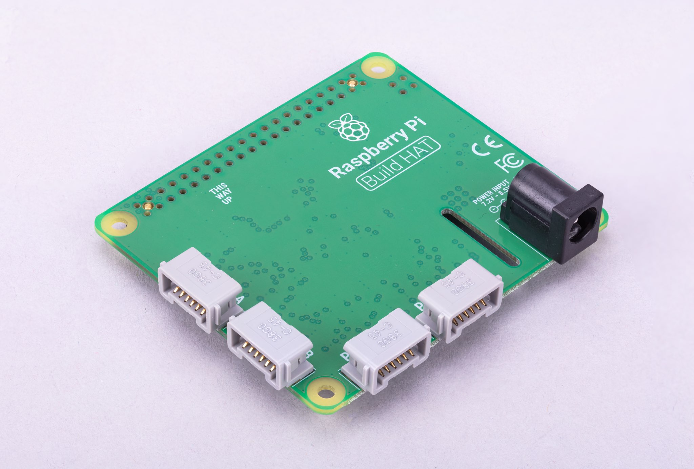

# golang-build-hat

This is a library which interfaces with the raspberry pi build hat from Go. It is currently a work in progress, with my primary goal to drive some motors in a basic robot I have built.

# Raspberry Pi Build HAT

The [Raspberry Pi Build HAT](https://raspberrypi.com/products/build-hat) is an add-on board that connects to the 40-pin GPIO header of your Raspberry Pi, which was designed in collaboration with LEGO® Education to make it easy to control LEGO® Technic™ motors and sensors with Raspberry Pi computers.

Read more about it in the [Raspberry Pi Build HAT documentation](https://www.raspberrypi.com/documentation/accessories/build-hat.html).

# Status

* [x] Firmware Uploading
* [ ] Board initialisation and status
* [ ] Motor control
* [ ] Board Reset

# License

This application is released under MIT license and is copyright Mark Wolfe.